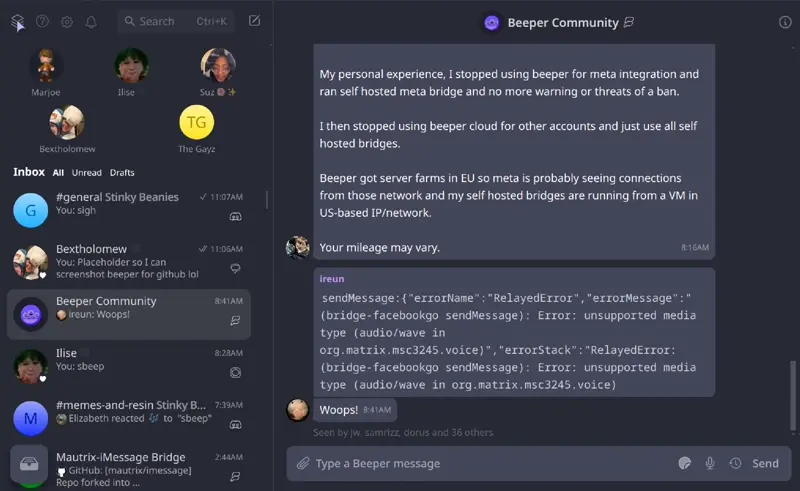

  <h1 style="border-bottom: 0">Beeper Dracula</h1>
  <figure>
    
    <h3 style="margin-top: 0; padding-top: 0">
      Unofficial Dracula theme for
      <a href="https://www.beeper.com">Beeper Desktop</a>
    </h3>
  </figure>
  <figure>
    
     
    <figcaption><b>Preview</b></figcaption>
  </figure>

<h2 align="center">Install</h2>

1. Open Beeper settings.
2. Navigate to the "Labs" section.
3. Enable "Use new Chat View" and "Enable Chat View animations".
4. Navigate to the "Appearance" section.
5. Make sure theme is set to "Dark", and disable "Use profile pictures to color messages".
6. Copy the contents of the "dracula.css" file in this repository (you can download it or copy it directly from the raw view) and paste it into the "Custom CSS " section.
7. Click apply and enjoy! (Note: You will need to accept a pop-up to re-apply the theme each time you restart Beeper)
